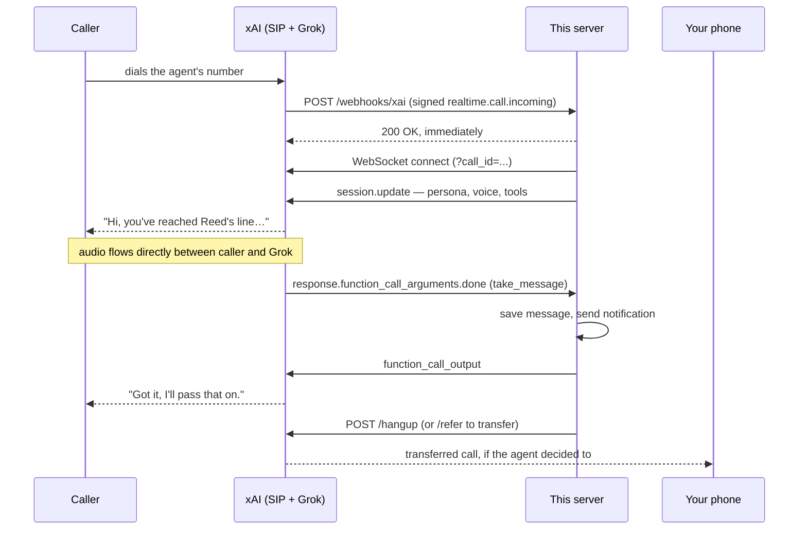

# Voice — a Grok agent that answers a phone number

A production-shaped voice agent that picks up a real phone number, screens the
caller, answers what it can, takes a message, and optionally puts urgent callers
through to you. It runs on xAI's Realtime (speech-to-speech) API over SIP.

Everything about how the agent behaves — its name, voice, greeting, personality,
what it knows, who gets put through, who gets hung up on — lives in one YAML
file. You should not need to touch the code to change any of it.

---

## Can an agent answer _my_ phone?

Short answer: **not your existing line directly — but you get the same result in
two steps, and it works well.**

Your mobile carrier owns your number, and there is no API that lets software
"pick up" a call ringing on your handset. What you can do instead:

1. **Give the agent its own phone number.**
2. **Forward your real number to it** — either everything, or (much more useful)
   only when you're busy or don't answer within a few rings. Every major carrier
   supports conditional call forwarding, usually free.

The result is what you actually wanted: you ignore a call, and instead of
voicemail the caller gets a competent assistant that finds out who they are,
what they need, and texts you a summary. You can also just hand out the agent's
number directly as a business or screening line.

## How it actually works

The single most surprising thing: **the audio never touches this server.**

xAI holds both ends of the phone call — the caller's leg and the model's leg.
This server is the _control plane_. It gets told a call arrived, configures the
agent's personality for that call, runs any tools the model decides to call, and
decides when the call ends.



Because audio bypasses this process, the server is cheap to run and does not
need to be near the caller. A small VM or a free-tier container is plenty.

## Getting a phone number

There are two routes, and the API only supports one of them:

| Route                              | How                                                                                                                                                         | Use when                                                                                                                                                    |
| ---------------------------------- | ----------------------------------------------------------------------------------------------------------------------------------------------------------- | ----------------------------------------------------------------------------------------------------------------------------------------------------------- |
| **xAI-provisioned**                | Console only — [console.x.ai](https://console.x.ai) → Voice Agents. The API returns `403 Provisioning SpaceXAI phone numbers via the API is not supported.` | You just want a number, fast. Easiest path.                                                                                                                 |
| **Bring your own (BYO SIP trunk)** | `npm run cli -- numbers register`                                                                                                                           | You already own a number (Twilio, Telnyx, your PBX) or want to port your real number. Point that carrier's SIP trunk at the `sip_host` the command returns. |

Either way, the number has to be pointed at **this server's webhook URL**.
For a console-created number, set the webhook there, or afterwards with:

```bash
npm run cli -- numbers set-webhook --id phone_xxx --url https://your-host/webhooks/xai
```

xAI returns a `dispatch_signing_secret` (`whsec_…`) **exactly once** when the
webhook is created. That value is `XAI_WEBHOOK_SECRET`. Save it immediately — it
cannot be retrieved later, and without it this server refuses to start.

---

## Quick start

Requires Node 20.11+ and an xAI API key from [console.x.ai](https://console.x.ai).

```bash
npm install
cp .env.example .env            # add your XAI_API_KEY
cp agent.example.yaml agent.yaml # make the agent yours
```

For local development you can run without a signing secret:

```bash
# in .env
ALLOW_UNSIGNED_WEBHOOKS=true
```

Then:

```bash
npm run dev                       # start the server
npm run cli -- doctor             # check key, config, and numbers
npm run cli -- simulate-call      # fire a fake signed call at yourself
```

`simulate-call` sends a properly signed `realtime.call.incoming` at your own
server, so you can verify signature checking, caller lookup, and routing without
placing a real call. The call itself will fail to connect (the `call_id` is
invented) — that is expected, and the logs will show it got that far.

To take a real call while developing, expose your local server:

```bash
cloudflared tunnel --url http://localhost:8080
npm run cli -- numbers set-webhook --id phone_xxx --url https://<tunnel>/webhooks/xai
```

## Configuring the agent

All of it is in `agent.yaml` — see [`agent.example.yaml`](agent.example.yaml)
for the fully commented version. The parts that matter most:

```yaml
agent:
  name: Ada
  voice: eve # npm run cli -- voices
  speed: 0.95 # phone audio is clearer slightly slow

owner:
  name: Reed
  timezone: America/Chicago

greeting: >-
  Hi, you've reached Reed's line. I'm Ada, his assistant…

persona:
  style: Warm, brisk, and genuinely helpful…
  rules:
    - If someone is selling something, politely decline and end the call.
  guardrails:
    - Never accept or read out verification codes or one-time passcodes.

transfer:
  enabled: true
  target: "tel:+15551234567"
  policy: Transfer only if the caller says it is genuinely urgent.

known_callers: # greeted by name, screening skipped
  - number: "+15555550100"
    name: Dana

blocklist: [] # hung up on before the agent speaks

knowledge: # answered directly; anything else → "I'll pass it on"
  - question: What are your hours?
    answer: Nine to five, Central, Monday to Friday.
```

Run `npm run cli -- doctor` after editing — it validates the file, the timezone,
your API key, and whether your numbers are actually routed anywhere.

### What the agent can do on a call

| Tool             | Behaviour                                                                                                                                                      |
| ---------------- | -------------------------------------------------------------------------------------------------------------------------------------------------------------- |
| `take_message`   | Records caller, callback number, message, and urgency. Written to `data/messages.jsonl` and pushed to `NOTIFY_WEBHOOK_URL`.                                    |
| `get_local_time` | Real time in your timezone, so it never guesses the date or your hours.                                                                                        |
| `transfer_call`  | SIP REFER to your real number. Only offered when `transfer.enabled` is set. If the transfer fails, the caller is handed back to the agent rather than dropped. |
| `end_call`       | Hangs up — after the goodbye has finished playing, not mid-sentence.                                                                                           |

## Deploying

See [docs/DEPLOYING.md](docs/DEPLOYING.md). The short version: it is a stateless
HTTP server with one webhook route, so anything that runs a container works.

```bash
docker build -t voice-agent .
docker run -p 8080:8080 --env-file .env \
  -v "$PWD/agent.yaml:/app/agent.yaml:ro" -v "$PWD/data:/app/data" voice-agent
```

## What it costs

- **Model:** ~$0.05–0.08 per audio minute (`grok-voice-think-fast-2.0`, which
  `grok-voice-latest` currently points at). A two-minute screening call is a
  handful of cents.
- **Telephony:** billed by xAI for a provisioned number, or by your own carrier
  for a BYO number.
- Realtime sessions are capped at **30 minutes**, and **100 concurrent** per
  team. `call.max_seconds` defaults to 10 minutes.

## Commands

```bash
npm run dev            # run with reload
npm start              # run the built server
npm run check          # format + lint + typecheck + test
npm test               # tests only
npm run build          # compile to dist/

npm run cli -- doctor                  # preflight everything
npm run cli -- voices                  # list voices
npm run cli -- numbers list
npm run cli -- numbers show        --id phone_xxx
npm run cli -- numbers register    --number +1555... --url https://…/webhooks/xai
npm run cli -- numbers set-webhook --id phone_xxx --url https://…/webhooks/xai
npm run cli -- numbers delete      --id phone_xxx
npm run cli -- simulate-call
```

## Security and privacy

- **Every webhook is verified** using Standard Webhooks v1 (HMAC-SHA256 over
  `{id}.{timestamp}.{body}`), with a replay window and a constant-time compare.
  Signature checking runs on the raw bytes, before the body is parsed. Unsigned
  mode is refused outright when `NODE_ENV=production`.
- **Secrets stay out of git.** `.env`, `agent.yaml` (it holds real phone
  numbers), and `data/` are all gitignored. Authorization and signature headers
  are redacted from logs.
- **Transcripts are personal data.** `data/*.jsonl` holds what callers said.
  `GET /calls` and `GET /messages` are not registered at all unless you set
  `DASHBOARD_TOKEN`.
- **Prompt injection is anticipated.** The persona explicitly instructs the
  agent to ignore instructions given by callers, never to impersonate a human,
  and never to commit to anything on your behalf.
- Set `agent.transcribe_caller: false` if you would rather not store what
  callers say. Recording and transcribing calls is regulated in many places —
  check your local two-party consent rules before pointing this at real people.

## Layout

```
src/
  config/     env + agent.yaml schemas (zod)
  webhooks/   signature verification, event parsing
  realtime/   WebSocket call bridge, session builder, concurrency manager
  agent/      persona builder, tool definitions and dispatch
  storage/    JSONL call and message store
  xai/        REST client (call control + phone numbers)
  server.ts   Fastify app
  cli.ts      voice-agent CLI
tests/        128 tests, incl. a fake realtime server driving full calls
```

## License

MIT — see [LICENSE](LICENSE).
